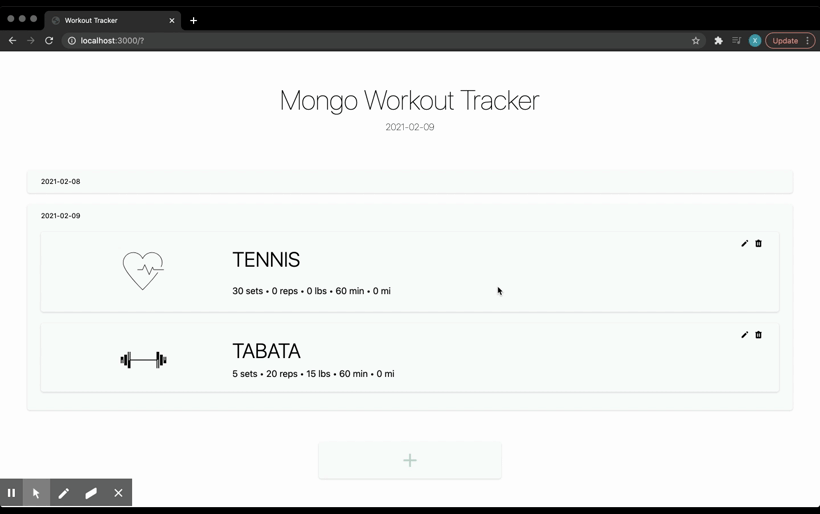

# Workout Tracker

## Description

This is a workout tracker. The application use Mongo database with a Mongoose schema and handle routes with Express.

## Table of Contents

- [Deployed Application](#Deployed-Application)
- [Usage](#usage)
- [Installation](#installation)
- [Contributing](#contributing)
- [Questions](#questions)
- [License](#license)

## Deployed Application

[Workout Tracker](https://workoutapp-mongo.herokuapp.com/)

## Usage

- The application allow user to view create and track daily workouts, log multiple exercises in a workout on a given day, and also be able to track the name, type, weight, sets, reps, and duration of exercise.

## Installation

To install necessary dependencies, run the following command:

      npm i

## Contributing

      folk / pull

## Questions

If you have any questions about the repo, open an issue or contact me directly @[xiaoyz28@uw.edu](xiaoyz28@uw.edu). You can find more of my work at [zhuxiaoyu1019](https://github.com/zhuxiaoyu1019).

## License

Copyright (c) Rita Z. All rights reserved.

Licensed under the [MIT](https://choosealicense.com/licenses/mit/) license.
